# Problem with running script for actual data

`ImperialCollegeLondon/covid19model` script is good for modeling early phases of pandemic. Dataset used in article was
actual up to 24/04/2020. It contains information about daily new cases, deaths, ifr and non-pharmaceutical interventions.
It was enough to estimate effects of non-pharmaceutical interventions on COVID-19 pandemic, but today situation has
changed.

## Results comparison

Table below shows results comparison for some countries.

| Result | 24/04/2020 | 02/12/2020 |
| ------------------ | ------------------ | ------------------ |
| Austria forecast | 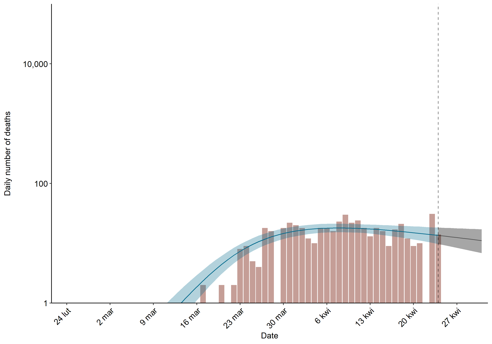 | 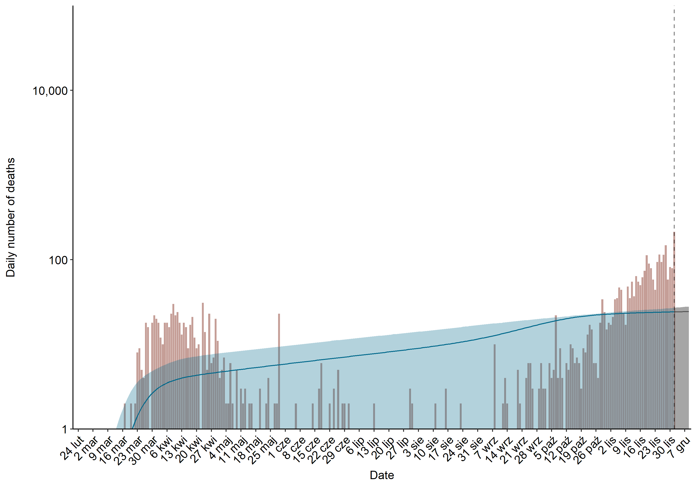 |
| Belgium forecast | 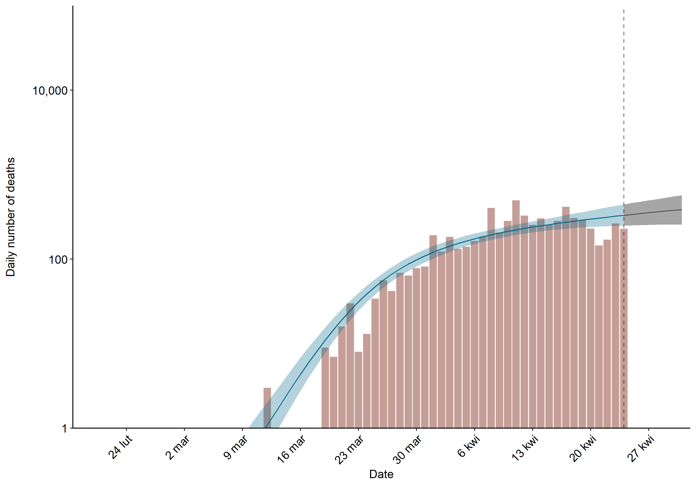 | 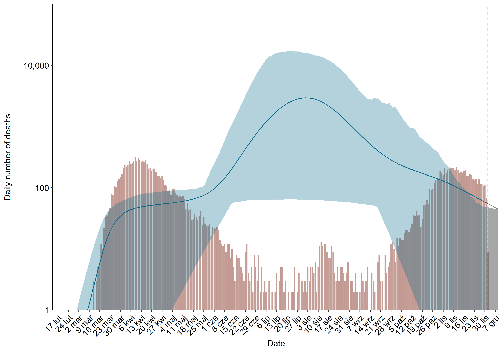 |
| Italy forecast   | 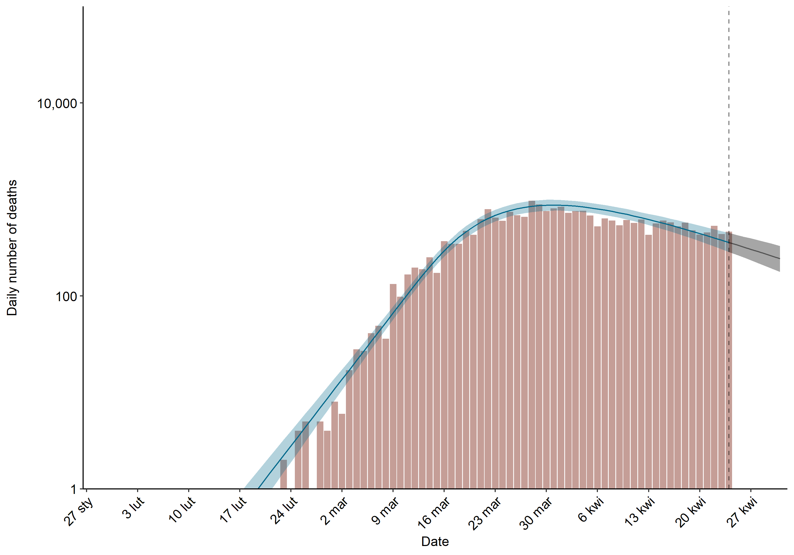   | 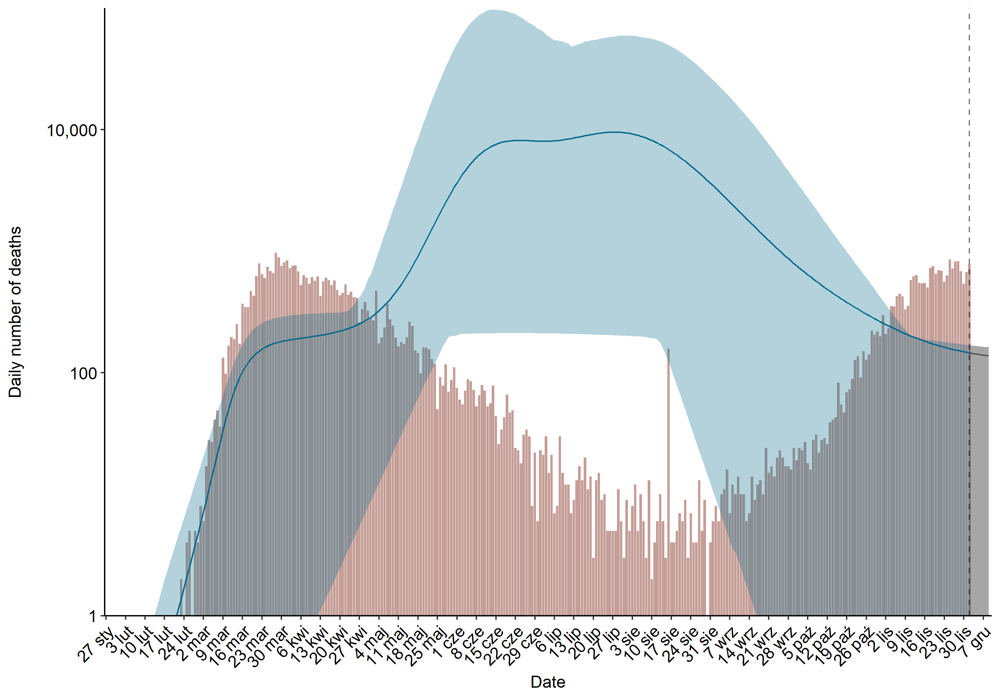   |

### Italy three pannel
#### 24/04/2020
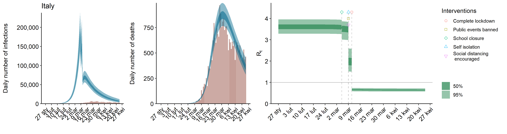
#### 02/12/2020
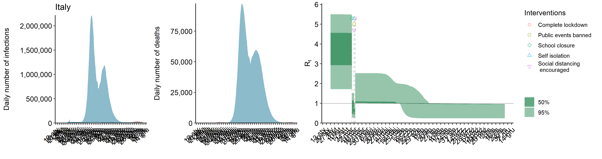

### Belgium three pannel
#### 24/04/2020
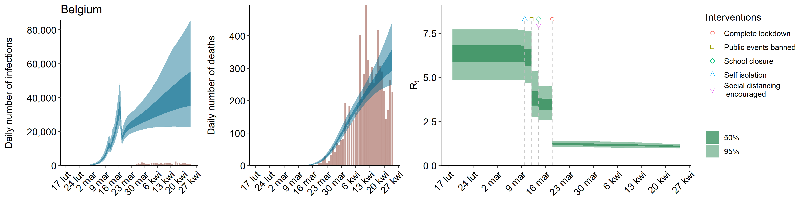
#### 02/12/2020
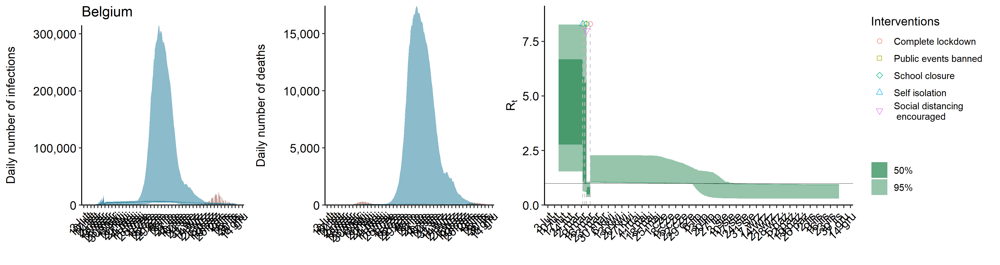

### Austria three pannel
#### 24/04/2020
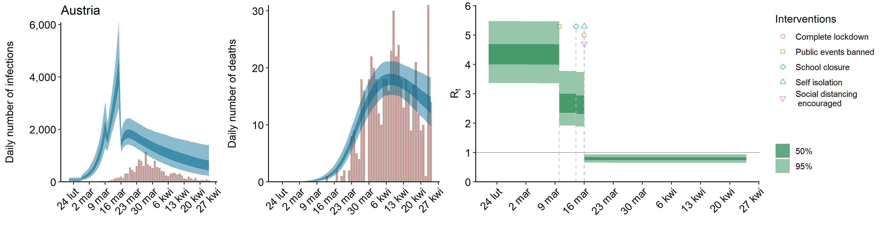
#### 02/12/2020
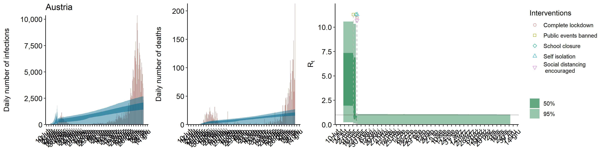

## Probable causes

There are some probable reasons, why results of forecast are not satisfying for the next stages of the pandemic.

### Lockdowns resolve
Script does not features data about lockdown resolves. For `base.r` it is necessary to insert data about these
non-pharmaceutical interventions and dates of thier introductions:
- closure of schools and universities,
- self-isolating if ill,
- ban on public events,
- lockdown,
- social distancing encouraged
But in fact, at the end of the "first wave" of COVID-19 pandemic, which has expired in the summer, countries resolves most of
introduced interventions. Script does not take it into account.

### Non "normal distribution" shape
During early phases of COVID-19 pandemic it was easy to see, that number of daily cases resembled normal distribution chart shape.
The shape of chart was modificated by non-pharmaceutical interventions, like lockdown, school closures, etc.
But knowing the nature of coronaviruses, we know that pandemic has some peaks of people infected. Script seems to not support
multiple waves of COVID-19 pandemic. It tries to fit the forecast to normal distribution and totally miss the daily new cases.
