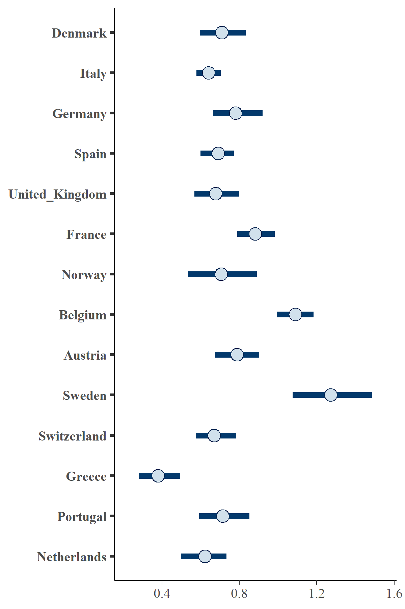

# Problem with running script for actual data

`ImperialCollegeLondon/covid19model` script is good for modeling early phases of pandemic. Dataset used in article was
actual up to 24/04/2020. It contains information about daily new cases, deaths, ifr and non-pharmaceutical interventions.
It was enough to estimate effects of non-pharmaceutical interventions on COVID-19 pandemic, but today situation has
changed.

## Results comparison

Table below shows results comparison for some countries.

| Result | 24/04/2020 | 02/12/2020 |
|-|-|-|
| s | s | s |
| s | s |s  |
|  |  |  |

## Probable causes

### Lockdowns resolve

